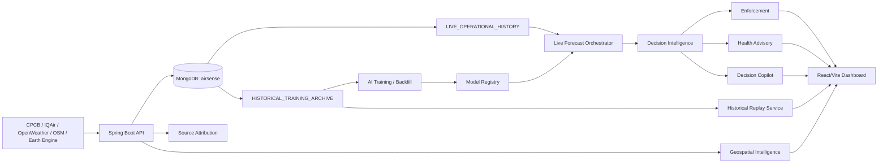

# 01 - System Blueprint

Last updated: 2026-07-18T17:37:59+05:30

## 1. Product Boundary

Urban Air Quality Intelligence is a municipal decision-support system. It combines official current AQI, station-isolated forecasts, source attribution, geospatial layers, enforcement recommendations, health advisories, Copilot answers, and historical replay evidence.

## 2. Non-Negotiable Guardrails

The system preserves provider provenance, AQI standard labels, station identity, model promotion gates, and null semantics. It must not synthesize replay rows, backfill missing actuals with zero, mix AQI standards, or present fallback forecasts as validated ML.

## 3. Runtime Components

- Frontend: React/Vite dashboard in `src`.
- Backend: Spring Boot API in `backend`.
- AI service: Python forecasting and model tooling in `ai-service`.
- Database: MongoDB database `airsense`, now restored to MongoDB Atlas for runtime use with the local MongoDB copy retained as rollback.
- Maps: Leaflet with OpenStreetMap raster tiles.

## 4. Primary Users

Municipal operators use the government dashboard for forecast monitoring, enforcement prioritization, source attribution, geospatial review, and Copilot-supported explanation. Citizens use the citizen dashboard and advisory surfaces for personal guidance.

## 5. Frontend Shell

`DecisionDashboard.jsx` owns the municipal shell, route layout, city/station selection, dashboard state, and page composition. It keeps live forecasts, historical replay, maps, advisories, enforcement, and Copilot panels as separate views over backend payloads.

## 6. Authentication

The frontend calls `POST /api/v1/auth/login` and stores the session in Redux memory. Protected municipal routes require the admin role; browser reloads require login again because auth is not persisted to local storage.

## 7. API Base URL

The frontend uses `VITE_API_BASE_URL` when supplied, otherwise `http://localhost:8082/api/v1`.

## 8. Current AQI Selection

Current AQI is CPCB-first when a fresh valid same-standard station is available. Fallback providers retain explicit provider and standard labels and are not merged into CPCB `INDIA_NAQI` results.

## 9. Station Identity

Station identity is carried through `stationKey`, `stationLocationKey`, `locationKey`, station name, provider, and AQI standard. Replay and forecast logic use same-station matching rather than city-level substitution.

## 10. Snapshot Identity

Decision payloads propagate a fused snapshot identifier across current AQI, forecast, attribution, enforcement, advisory, and Copilot context so downstream decisions can be tied to one evidence state.

## 11. MongoDB Data Stores

The active backend database is `airsense`. Runtime deployment uses `MONGODB_URI` and the Atlas migration uses `MONGODB_ATLAS_URI`; neither value is committed. The local `airsense` database remains intact as rollback. The historical/replay source collection is `aqi_historical_snapshots`; model and evaluation state use collections such as `aqi_forecast_runs`, `forecast_model_registry`, and `forecast_retraining_requests`.

## 12. Data Origins

`LIVE_OPERATIONAL_HISTORY` is live runtime history and may support live forecast lag features only when freshness, gap, and coverage gates pass. `HISTORICAL_TRAINING_ARCHIVE` is verified archive data for training/backfill/replay and is not treated as fresh live operational history.

## 13. Forecast Training

Training artifacts are produced by the AI service with chronological splits, lag/rolling/weather/cyclical features, delta targets, baseline comparison, and promotion metadata. This task did not retrain or promote models.

## 14. Live Forecast Inference

Live inference uses promoted models only when schema, promotion, station scope, standard, freshness, and history coverage are valid. Otherwise it returns visible fallback modes such as persistence or trend with explicit reasons.

## 15. Model Registry

The model registry stores model scope, horizon, standard, version, checksum, promotion status, rollback eligibility, and validation metadata. Rollback switches active versions after metadata and checksum validation; it does not delete old artifacts.

## 16. Historical Replay

Historical replay is a read-only validation workspace under `/api/v1/air-quality/forecast/historical-replay`. It uses same-station `HISTORICAL_TRAINING_ARCHIVE` rows, `INDIA_NAQI`, and issue-time-or-earlier observations only. Future actuals are loaded only for comparison.

## 17. Replay Engine

The current replay engine is `HISTORICAL_PERSISTENCE_REPLAY` with model version `historical-persistence-v1`. It is not a production live forecast and does not change model promotion or live inference eligibility.

## 18. Replay Catalogue

The catalogue returns only stations with usable verified archive coverage:

- `gomti_nagar_lucknow_uppcb`: 21,544 archive rows.
- `ito_delhi_cpcb`: 20,485 archive rows.
- `bandra_kurla_complex_mumbai_mpcb`: 7,769 archive rows.

## 19. Replay Diagnostics

`GET /api/v1/air-quality/forecast/historical-replay/diagnostics` reports active database, profiles, collection, total rows, provider/standard/origin values, timestamp fields, min/max timestamps, supported station coverage, and rejected-row counts.

## 19.1 Atlas Migration State

The local `airsense` database was dumped to `D:\MongoBackup\atlas-migration-20260718-170809` and restored to MongoDB Atlas without transforming data. Atlas collection counts match local counts for all 22 collections. The exact verified `HISTORICAL_TRAINING_ARCHIVE` + `INDIA_NAQI` replay counts are Gomti 21,544, ITO 20,485, and BKC 7,769. The backend Atlas runtime is environment-based: set `MONGODB_URI` from the Atlas secret and ensure the database name is `airsense`, either in the URI path or through `spring.data.mongodb.database=airsense`.

## 20. Source Attribution

Attribution fuses evidence across source categories and preserves supporting, contradicting, missing, unknown, and confidence signals. The frontend labels attribution as evidence, not proof.

## 21. Geospatial Intelligence

Geospatial APIs provide hotspot, plume, route, boundary, and point layers with source/degraded/confidence labels. The frontend renders these through Leaflet and OpenStreetMap, eliminating browser map API-key dependency for the municipal map.

## 22. Enforcement

Enforcement pages render existing backend recommendations, agencies, priorities, confidence, and action items. Viewing the page does not mutate enforcement workflow state.

## 23. Health Advisory

Health advisory pages render citizen-facing risk, vulnerable groups, guidance, confidence, and generation time separately from enforcement action planning.

## 24. Copilot

The Copilot receives bounded context from decision, forecast, attribution, geospatial, enforcement, advisory, timeline, city, and snapshot data. It is a grounded explanation surface, not an autonomous action taker.

## 25. Evaluation And Drift

Drift evaluation reads matured forecast runs, compares prediction against observed actuals inside tolerance windows, reports skipped immature/missing-actual counts, and records drift/retraining request state without doing in-request training.

## 26. Failure Semantics

Unavailable data remains null or visibly unavailable. API errors surface as error states. Replay unsupported-station and missing-actual cases are explicit. Browser route reloads require re-authentication because auth is memory-scoped.

## 27. Data Flow

